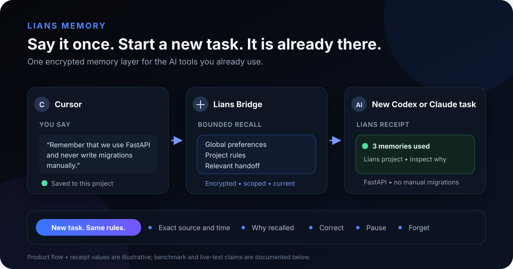

<p align="center">
  <a href="https://github.com/Lians-ai/Lians">
    
  </a>
</p>

<p align="center">
  <a href="docs/install.md">Install</a> ·
  <a href="docs/easy-install.md">Desktop preview</a> ·
  <a href="https://github.com/Lians-ai/Lians/tree/master/docs">Docs</a> ·
  <a href="https://github.com/Lians-ai/Lians/issues">Issues</a>
</p>

<p align="center">
  <a href="https://pypi.org/project/lians-sdk"></a>
  <a href="https://www.npmjs.com/package/@lians-ai/lians"></a>
  <a href="https://registry.modelcontextprotocol.io/?q=io.github.ebeirne%2Flians"></a>
  <a href="LICENSE"></a>
  <a href="https://github.com/Lians-ai/Lians/stargazers"></a>
</p>

# Use less context. Get more AI.

Lians helps Claude, Cursor, Codex, and other AI tools stop rereading the same
project context.

Save a useful preference, fact, constraint, or decision once. In a later task,
Lians reuses only a small relevant slice and leaves the rest out. You keep your
model, editor, and normal workflow.

- **Local by default:** encrypted saved context stays on your device.
- **No AI credentials:** Lians does not ask for your Claude, Cursor, or Codex
  password or provider API key.
- **Measured:** signed receipts record what was reused, what was excluded, and
  the estimated repeated memory context avoided.
- **Portable:** one local store can support multiple compatible AI tools.

<p align="center">
  
</p>

## Try Lians in two chats

Choose the AI tool you already use:

| Tool | Fastest current setup |
|---|---|
| Cursor | [One-click MCP install](integrations/cursor) |
| Claude Code | [Two plugin commands](integrations/lians-plugin) |
| Codex app, CLI, or IDE | [One-command MCP setup](integrations/codex) |
| Other MCP clients | [Minimal local MCP configuration](#minimal-local-mcp-setup) |

Then try:

```text
Remember that this project uses Python 3.12 and pytest.
```

Open a new chat in the same project and ask:

```text
What Python version and test runner does this project use?
```

Lians can reuse the saved detail without replaying the whole previous chat.

<p align="center">
  <a href="https://github.com/Lians-ai/Lians/releases/download/lians-memory-openai-demo-v1.0.0/Lians-Memory-OpenAI-submission-demo-v1.0.0.mp4"><strong>▶ Watch the 33-second remember, reuse, and delete proof</strong></a>
</p>

## The product

```text
Open Lians → choose your AI apps → keep working normally
                                      ↓
                         relevant saved context only
                                      ↓
                         visible efficiency receipt
```

The desktop product detects supported AI apps and connects the ones a user
selects. Claude, Codex, Gemini CLI, and Antigravity can receive bounded context
through prompt hooks. Cursor uses its MCP connection and a generated project
rule. The underlying memory, correction, backup, and deletion controls remain
available when someone wants them; they are not the main job to be done.

From a source checkout, developers can exercise that flow today:

```bash
python -m pip install -e packages/lians-easy
lians optimize --clients detected --plan
lians optimize --clients detected --yes
lians status
```

Running `lians` with no subcommand opens guided setup. The Windows and macOS
desktop artifacts are tested release candidates, not yet trusted consumer
downloads: general promotion remains gated on Windows publisher signing and
Apple Developer ID signing/notarization. See the
[desktop preview boundary](docs/easy-install.md).

## What is real today

| Capability | Status |
|---|---|
| Free local memory through MCP and Python | Available |
| Cursor, Claude Code, Codex, Gemini, Antigravity, Windsurf, Cline, and OpenCode setup paths | Available |
| Guided desktop installer and local control center | Release candidate; source/CI evaluation only until signing |
| Bounded context and signed selection receipts | Available |
| Estimated repeated memory tokens avoided | Available in receipts, `lians status`, and the local status API |
| Managed cross-device continuity | Technical preview; not a general-availability claim |

## Evidence, not magic

In a balanced Cursor CLI stress test, bounded Lians-style context used
**24.72% fewer provider-reported input tokens** than a 201-line always-applied
rule while preserving all four exact answers. This is one synthetic workload,
not a promise of universal token savings.

A separate live test stored one synthetic project fact through Cursor, recalled
it in a new Cursor chat and a fresh Claude Code session, then confirmed that it
was gone after deletion. Read the
[methodology and raw aggregate evidence](docs/benchmarks/cross-agent-memory-2026-08-14.md).

Lians does not enlarge a provider context window or guarantee that every plan,
quota, or bill lasts longer. It measures the narrower claim it controls: how
much active saved memory could have been replayed, how much was selected, and
the estimated repeated memory content left out.

## Minimal local MCP setup

Install [`uv`](https://docs.astral.sh/uv/getting-started/installation/), then add
this server to an MCP-compatible AI tool:

```json
{
  "mcpServers": {
    "lians": {
      "command": "uvx",
      "args": ["--from", "lians-sdk[mcp]", "lians-mcp"],
      "env": {
        "LIANS_MCP_ENABLED_TOOLS": "remember,recall,list_memories,correct_memory,forget_memory"
      }
    }
  }
}
```

Restart the AI tool. Local memory is stored in `~/.lians/mcp.db`; no Lians
account, Docker service, or provider API key is required. The first use may
download the local semantic model.

## Use Lians inside an application

```bash
pip install "lians-sdk[local]"
```

```python
from datetime import datetime, timezone
from lians import LocalLiansClient

memory = LocalLiansClient(db_path=".lians/memory.db")
memory.add(
    agent_id="my-agent",
    content="The project uses Python 3.12 and pytest.",
    event_time=datetime.now(timezone.utc),
)

result = memory.recall(
    agent_id="my-agent",
    query="Which Python version and test runner should I use?",
)
```

See the [full install guide](docs/install.md) for TypeScript, Go, Java, C,
framework integrations, and self-hosting.

Running a class, club, hackathon, or campus developer group? The
[student and community kit](docs/student-community-kit.md) contains a small
workshop and project track. If you cloned the monorepo and are deciding which
package is current, start with
[Supported paths and repository status](docs/supported-paths.md).

The short [product direction](docs/product-direction.md) defines the customer,
default experience, claims boundary, build order, and success metrics.

<details>
<summary><strong>Advanced memory and governance capabilities</strong></summary>

Lians can supersede stale facts, reconstruct point-in-time state, inspect
lineage and conflicts, maintain tamper-evident audit history, enforce
information barriers, and perform confirmed erasure. These capabilities are
available for applications and teams that need them; they are not required to
get started.

- [Memory engine](docs/memory-engine.md)
- [Decision evidence](docs/decision-evidence.md)
- [Security model](docs/security-whitepaper.md)
- [Community and managed product boundary](docs/community-cloud-boundary.md)

</details>

## Repository map

```text
packages/lians-easy/        Desktop runtime, installer, control center, and receipts
agentmem/sdk/python/        Python SDK, local client, and MCP server
agentmem/src/lians/         Core engine and HTTP service
integrations/               AI-client and framework connections
plugins/                    Installable agent plugins
docs/                       Setup, evidence, security, and operations
```

## Development

```bash
git clone https://github.com/Lians-ai/Lians.git
cd Lians
python -m pip install -e ".[dev]"
python scripts/test_all.py
```

Read [CONTRIBUTING.md](CONTRIBUTING.md) for focused test commands and project
conventions. Ask questions or report problems in
[GitHub Issues](https://github.com/Lians-ai/Lians/issues).

If Lians helps your workflow, [star the repository](https://github.com/Lians-ai/Lians/stargazers)
so other AI-tool users can find it.

## License

Apache 2.0 - see [LICENSE](LICENSE).

<!-- mcp-name: io.github.ebeirne/lians -->
