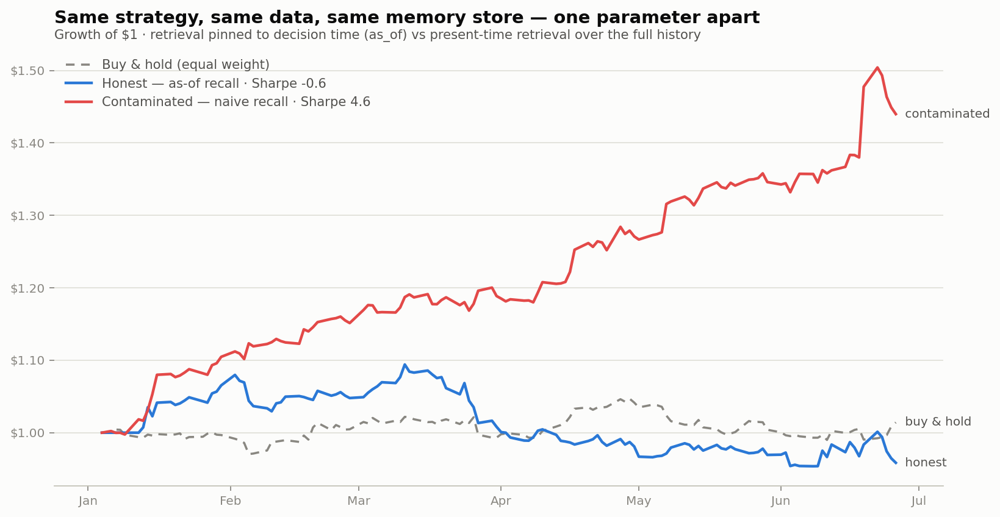

# Your Agent's Memory Is Contaminating Your Backtest

**A reproducible demo of lookahead bias in agent memory — and the one-parameter fix.**
No API keys. No network. `python run_demo.py`, ~30 seconds.



| run | retrieval | total return | Sharpe |
|---|---|---:|---:|
| **Contaminated** | `recall()` — present-time recall over the full history | **+44.0%** | **4.6** |
| **Honest** | `recall_at(as_of=decision_time)` | −4.2% | −0.6 |
| Buy & hold | — | +1.4% | 0.4 |

Same strategy. Same data. Same memory store. The entire diff between the two
runs is one parameter.

## The bug class

Quant teams spend enormous effort keeping lookahead bias out of *price and
fundamentals* data — point-in-time databases, restatement handling, survivorship
filters. Then they bolt an LLM agent onto the research stack, give it a memory
layer, and reintroduce the exact bug they spent decades eliminating.

Here's how it happens. Your agent accumulates memories: earnings notes, analyst
reactions, guidance changes. Each memory is created at some moment in time. Then
you backtest the agent. At simulated date **D**, the agent asks its memory,
*"what do I know about AVLN?"*

A standard vector store answers with the most *relevant* memories — from the
entire store. Relevance has no time axis. So the retrieval at D quietly includes
a note written at D+1: *"AVLN beats Q1 consensus; management raises full-year
guidance."* The agent buys the day before the announcement. Every time.

Your backtest Sharpe is now a work of fiction, and nothing crashed. No error, no
warning — just a strategy that "works" in simulation and evaporates live.

## What this repo does

1. **Builds a synthetic market** (`generate_dataset.py`, seed=42): 6 fictional
   tickers, 125 trading days, 24 scheduled events (earnings, guidance revisions,
   rating actions). Event outcomes move prices 3.5–7.5% on the event day.
2. **Populates one memory store** with 75 timestamped research notes: neutral
   previews *before* each event, outcome notes *on* the event morning, analyst
   reactions the day *after*, plus macro desk-note noise.
3. **Runs the same deliberately-dumb strategy twice.** Each day, for each
   ticker: query memory, score the retrieved notes with a keyword lexicon
   (+beats/raises/upgrade, −misses/cuts/downgrade), go long/short/flat.
   - Contaminated run: `mem.recall(...)` — what any plain vector store does.
   - Honest run: `mem.recall_at(..., as_of=decision_time)` — retrieval pinned
     to what was knowable at decision time.
4. **Prints the receipts.** Every contaminated retrieval is logged: decision
   timestamp, the note that was retrieved, the note's timestamp, and how many
   days in the future it was created. In this run: **918 retrievals of
   future information** across 124 decision days ([receipts.md](results/receipts.md)).

The synthetic market is the point, not a limitation: because we control exactly
which information existed when, the leak is *measurable* — every contaminated
retrieval is provable from the data files, and the whole thing reproduces
bit-for-bit with zero API keys. The causal structure it encodes (the note
describing an outcome cannot exist before the outcome) is true of every real
market. Fictional tickers are used so no real company's facts are misstated.

## The receipts

Excerpt — retrieval at decision time surfacing notes that did not exist yet
(full table: [results/receipts.md](results/receipts.md)):

| decision time | ticker | retrieved note (created later) | days in future | position | next-day return |
|---|---|---|---:|---:|---:|
| 2026-01-14 | AVLN | AVLN cuts FY outlook in an unscheduled January update; flags weak demand… | 0.6 | −1 | **−5.1%** |
| 2026-02-04 | HLIO | Sell-side downgrades HLIO to Underweight after the February news… | 1.7 | −1 | **−9.6%** |
| 2026-01-15 | CRDX | Sell-side upgrades CRDX to Overweight after the January news… | 1.7 | +1 | **+4.7%** |

The pattern in the full table is the tell: position sign matches the *future*
note's direction, and the biggest next-day returns cluster on event days the
agent "couldn't have known about."

## The programmatic proof

You don't have to eyeball equity curves. Lians ships a contamination detector —
run it against any simulation checkpoint before trusting a backtest:

```python
report = mem.backtest_check(agent_id="strategy", simulation_as_of=checkpoint)
# report["is_clean"]            -> False
# report["flags"]               -> per-memory receipts:
#   future_event   — the underlying event hadn't happened yet at the checkpoint
#   late_revision  — the event is old, but the note *arrived* after the checkpoint
#                    (the subtle case: revised figures used before they existed)
```

See [results/summary.md](results/summary.md) for the full report from this run.

## The kicker: this is also the audit question

"What did the system know at decision time?" is simultaneously:

- the **backtest question** — answered wrong, it silently inflates Sharpe;
- the **examiner's question** — SEC/FINRA asking why the model traded.

The same bitemporal `as_of` machinery answers both. A memory layer that can't
answer it can't do either job. That's the argument for point-in-time-correct
memory as infrastructure, not as a feature flag.

## Reproduce

```bash
pip install lians-sdk[local]      # or run from the Lians monorepo checkout
python generate_dataset.py        # optional — data/ is committed, seed=42
python run_demo.py                # writes results/ (~30s, CPU only)
```

Everything is deterministic: same seed, same local embedding provider, same
results. If you swap the memory layer for your own stack and the receipts table
is non-empty, your backtests have this bug.

## FAQ

**Isn't the strategy trivial?** Yes, deliberately. The strategy is a keyword
counter. The leak is the star — a smarter strategy only hides the mechanism.

**Would a recency filter fix it?** No. Filtering "memories from the last 30
days" still admits memories created *after* the decision date in a replay.
You need the memory's validity interval, not its topic date: a bitemporal
store distinguishes *when the event happened* from *when you learned it*.
`late_revision` contamination — old event, late-arriving correction — is
invisible to any single-timestamp scheme.

**Does this affect non-finance agents?** Any agent evaluated on historical
replays (support bots on past tickets, medical agents on past cases) inflates
its eval the same way. Finance just has a name for it.

---

Built on [Lians](https://github.com/Lians-ai/Lians) — the fully open,
self-hosted, compliance-grade memory layer: bitemporal correctness,
tamper-evident audit trails, cryptographic erasure. Apache 2.0.
