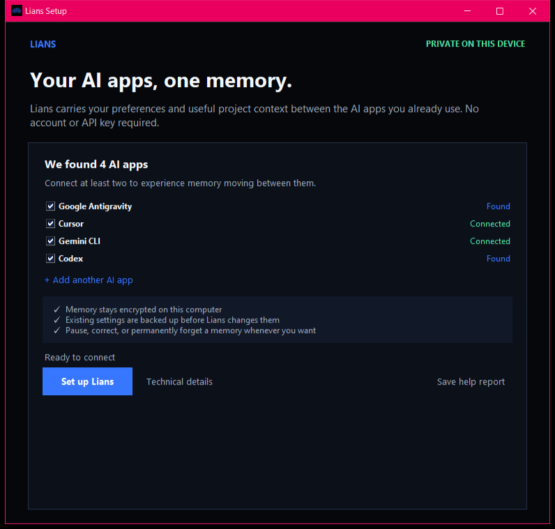

# Lians consumer product and installer contract

The consumer package is one Lians installer per operating system, not a separate
installer for every AI client. The installer places one local Lians Bridge on
the device, detects compatible AI apps, and lets the user connect any of them
from one screen.

The consumer promise is **Use less context. Get more AI.** Memory is the local
engine that makes this possible, not the job the user should have to manage.
The default experience should help someone optimize the AI tools they already
use, keep working normally, and see evidence that irrelevant saved context was
left out. Memory directories, lineage, receipts, backup, and deployment remain
available as controls and technical detail.

Product language must stay within the measured boundary:

- Say that Lians reduces repeated saved context and measures an estimate of what
  it leaves out.
- Say that this can help users get more useful work from the AI tools they
  already pay for.
- Do not promise that Lians extends every provider's plan, message cap, or
  billing quota. That requires provider-reported measurement in the installed
  product.
- Never ask for a Claude, Cursor, Codex, or other AI account password. Connect
  supported local clients through their documented plugin, hook, rule, or MCP
  configuration surfaces.

The reference implementation in
[`codefl0w/mtkclient-windows-installer`](https://github.com/codefl0w/mtkclient-windows-installer)
gets several operational details right: a single executable, an explicit step
engine, verification, a retry path, and a support log. Lians should keep those
mechanics while replacing the developer-facing presentation with a consumer
setup flow.



*Actual frozen Windows preview at 125% display scaling. It is a technical test
artifact until the publisher-signing gate passes.*

## What the user downloads

| Audience | Primary package | Secondary path |
|---|---|---|
| Windows user | Authenticode-signed `Lians-Setup-<version>.exe` | Microsoft Store or `winget` after the direct package is trusted |
| macOS user | Developer ID-signed and notarized `Lians-<version>-macos-<architecture>.dmg` | Homebrew for technical users |
| Linux user | Signed AppImage or Flatpak | Native packages when demand justifies them |
| Enterprise IT | Signed MSIX/PKG with silent options | MDM deployment and the existing CLI contract |

The consumer installer must bundle its runtime. It must not ask the user to
install Python, Git, `uv`, build tools, MCP tooling, or a model. Prefer a
per-user installation so setup does not request administrator access. If a
future capability truly requires elevation, ask at that step and explain the
specific reason before the operating-system prompt appears.

Downloaded Windows artifacts must also identify themselves before signing is
available: Explorer properties show **Lians Bridge**, the package version, the
original executable name, and the Lians lotus icon. Signing still remains a
separate release gate; product metadata must never be presented as a substitute
for a verified publisher.

The Windows package installs without elevation under the current account's
local Lians directory, adds **Lians** and **Uninstall Lians** to the Start menu,
and opens the same bundled control center as the frozen Bridge. Silent removal
disconnects Lians-managed client entries and keeps encrypted memory. Interactive
removal asks a separate, default-no question before permanently erasing memory
and settings.

The stable-release workflow keeps Windows desktop publication disabled unless
the repository explicitly sets `PUBLISH_SIGNED_LIANS_DESKTOP=true`. Even with
that opt-in, it imports only the configured publisher certificate, requires an
exact thumbprint match, signs both the installed runtime and setup executable,
re-verifies both Authenticode signatures, installs and exercises the resulting
package, and uploads it only after those checks pass.

Pull requests also build separate native Apple-silicon and Intel DMGs on real
macOS 15 runners. Each image contains **Lians.app** and an **Applications**
shortcut, declares its exact CPU architecture and minimum supported macOS
version, mounts read-only, copies like a normal drag-and-drop install, and runs
the bundled Bridge and encrypted Lians App from that installed copy. These
pull-request DMGs use only ad-hoc signatures and remain technical test fixtures.

Stable macOS publication is independently disabled unless
`PUBLISH_SIGNED_LIANS_MACOS=true`. That path requires an exact Apple Developer
ID identity and Team ID, signs PyInstaller's embedded code during the one-file
build, signs the app and DMG, requires an **Accepted** response from Apple's
notary service, staples and validates the ticket, runs Gatekeeper assessment,
repeats the mounted-package test, writes a SHA-256 checksum, and only then
uploads the architecture-labelled asset. Linux remains a separate unfinished
publisher path.

The control center exposes a manual **Check for updates** action without making
a background network request. The Bridge accepts only a stable `X.Y.Z` release
from the official Lians GitHub repository, selects the exact package for the
current Windows, macOS, or x86_64 Linux architecture, and offers it only when
the matching SHA-256 checksum is also published. **Download verified update** is a separate
user action: the Bridge fetches the bounded checksum first, streams the exact
package under a 512 MiB cap, verifies the complete digest, and saves it to
Downloads without overwriting anything. Downloading does not open the package.
A second confirmed action re-hashes the file and opens it only when Windows or
macOS validates the same publisher as the installed signed app; otherwise it
only reveals the file in Downloads. A future hands-off updater must additionally
preserve the previous signed runtime until the new signed runtime starts
successfully.

## First-run experience

The setup sequence has four moments:

1. **Promise and trust.** Lead with **Use less context. Get more AI.** Explain
   that Lians gives later tasks only useful saved context. State that saved
   context is encrypted locally, existing settings are backed up, and no AI
   account password or provider API key is required.
2. **Choose apps.** Detect installed clients, select them by default, and keep
   unsupported or absent clients behind **Add another AI app**. One connected
   app provides value; a second also demonstrates portability.
3. **Set up.** Show one progress bar and three plain-language states:
   **Protect your existing settings**, **Optimize your AI apps**, and **Check
   that Lians is ready**.
4. **Prove value.** Copy a ready-made `remember` prompt, tell the user to open a
   new task in the same or another app, and show the estimated context reused
   and left out. Do not end on a generic "installation complete" message.

The user should see the outcome, not the implementation:

| Internal operation | Consumer copy |
|---|---|
| Back up and atomically update client configuration | Protect your existing settings |
| Register MCP server, hook, plugin, or project rule | Optimize Cursor / Claude / Codex |
| Start Bridge and validate the client contract | Check that Lians is ready |
| Display configuration paths, commands, and exceptions | Technical details |
| Create diagnostic archive | Save support report |

Do not show dependency names, environment variables, repository cloning,
terminal output, or messages such as "administrator access granted" in the
default flow. They increase perceived risk without helping a nontechnical user
make a decision.

## Reliability behavior behind the simple UI

The hidden setup engine must be more rigorous than the visible interface:

- preflight disk space, OS support, client versions, write permissions, and a
  single running installer instance;
- back up every existing configuration before the first mutation;
- use atomic writes and verify every selected integration after writing;
- retry an individual failed integration without repeating successful work;
- roll back the current setup transaction when verification cannot complete;
- preserve unrelated client settings byte-for-byte where the file format
  allows it;
- keep a local support report with sensitive values removed;
- make uninstall remove only Lians-managed entries, then ask whether encrypted
  memory should be kept or permanently erased; and
- let the user pause all recall from the Lians tray or control center without
  uninstalling anything.

Technical details are progressive disclosure, not a separate product. The same
engine powers the consumer setup screen, the advanced CLI, and enterprise MDM
deployment.

The Bridge preview now treats every selected AI integration as its own file
transaction. It snapshots the exact original configuration and permissions,
verifies both the memory connection and automatic-recall hook, restores a
failed integration without disturbing successful ones, removes transaction
backup residue, and returns only failed client IDs to the retry action. The GUI
also writes a user-selected JSON help report containing runtime state and
client outcomes, while deliberately excluding settings contents, memory
contents, exception text, credentials, and user paths.

Setup now holds an operating-system file lock so a second installer cannot
mutate the same client concurrently. Before changing each client, it atomically
writes a disk-backed rollback journal containing only validated target paths
and backup references. If the process stops after a file replacement, the next
setup launch restores the exact prior state before retrying. A frozen Windows
binary passed a forced-exit harness at that point, including cleanup and
unrelated-settings preservation. A clean virtual-machine reboot/power-loss run
remains a generally available release gate.

Critical file replacement now requests durable rename metadata as well as
flushing file content: Windows uses `MoveFileEx` with replace and write-through,
while POSIX systems `fsync` the parent directory after atomic rename. Settings
backups use the same writer. This narrows the remaining power-loss gate to
release-artifact and filesystem behavior rather than an unflushed application
write path.

The preview executable now embeds the source-pinned React Lians App rather than
ending at setup or requiring a separately hosted dashboard. The final setup
action opens the loopback control center, and subsequent launches return there
directly. Artifact smoke tests verify the real frozen binary serves the app,
establishes its private session, reaches encrypted Bridge state, and exposes the
receipt-aware recall surface.

## Package architecture

```text
Lians-Setup-<version>.exe / Lians.dmg
  -> verifies publisher and package integrity
  -> installs one per-user Lians Bridge and Lians App
  -> detects supported AI clients
  -> configures selected integrations with backups
  -> starts Bridge and verifies a bounded recall receipt
  -> enables trusted, user-initiated update discovery
```

The installed product should expose:

- a Lians App for Home, Projects, Memory, Activity, Review, Integrations, and
  Settings;
- a small tray surface for status, pause, open Lians, and quit;
- the signed local Bridge with encrypted local memory and loopback-only access;
- optional cloud sign-in for sync and collaboration, never as a prerequisite
  for the local first run; and
- one integration manager that can add, repair, or remove clients later.

## Release gates

Do not call the installer generally available until all of these pass:

- a clean Windows 11 user with no Python or Git connects two detected clients
  without opening a terminal;
- a clean supported macOS user completes the same flow without a Gatekeeper
  bypass;
- Windows Authenticode, macOS Developer ID, notarization, package checksums,
  provenance, and update signatures verify in CI;
- an update from the previous signed release preserves memory and integrations,
  and a failed first launch restores the previous signed runtime;
- setup succeeds without administrator access for the normal per-user path;
- an interrupted setup resumes or rolls back without corrupting client files,
  including a clean virtual-machine reboot/power-loss run;
- each supported client passes `remember -> new task -> bounded recall ->
  inspect -> correct -> forget` against the release artifact;
- uninstall removes only Lians-managed integration state and clearly separates
  **Keep my memory** from **Permanently erase my memory**; and
- a nontechnical usability test can complete the cross-app memory moment in
  under three minutes without coaching.

The core packaging decision is therefore: **one product, one Bridge, one setup
experience, multiple integrations**. The CLI and raw log remain valuable for
developers and IT, but normal users should never need to know they exist.

The macOS DMG now proves delivery, identity, architecture, signing, notarization,
and the real packaged runtime. The control center also exposes Lians' two
different removal actions as separate plain-language choices: disconnect
selected AI integrations while keeping memory, or erase personal memory and
history while leaving integrations ready. Both require explicit confirmation,
and moving the app to Trash does not silently erase memory. The package remains
outside general availability until the real publisher credentials are supplied
and a nontechnical user passes the clean-Mac setup and removal flow.
