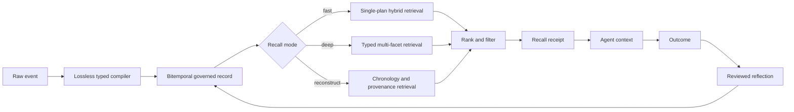

# Governed memory engine

Lians is a temporal memory engine with one governed record underneath recall,
learning, and decision reconstruction. The engine keeps the original content as
the source of truth, compiles it into typed artifacts, and returns a
content-addressed receipt with every recall.

## Execution path



## Lossless typed compilation

The compiler projects each write into one of these memory kinds:

- fact
- preference
- procedure
- episode
- outcome
- relationship
- policy
- reflection

The raw content is never replaced. The compiled projection is stored in
`metadata._lians_compiled` with a schema version, compiler version, confidence,
entities, temporal hints, source, event time, and the original content hash.
Callers can provide `metadata.memory_type` or `metadata.kind` when they have a
more authoritative classification.

This makes the memory useful for typed retrieval without introducing an
irreversible extraction step.

## Recall modes

Every recall selects an explicit execution policy:

| Mode | Intended use | Retrieval plan | Default latency budget |
|---|---|---|---:|
| `fast` | Interactive turns | One bounded hybrid search, hot-cache eligible | 100 ms |
| `deep` | Research and planning | Typed multi-facet retrieval, fusion, one final rerank | 800 ms |
| `reconstruct` | Historical and regulated review | Typed, chronology, and provenance facets with point-in-time filtering | 2,000 ms |

Example:

```python
result = client.recall(
    agent_id="agent-1",
    query="What changed in the policy and why?",
    mode="deep",
    k=10,
)

historical = client.recall(
    agent_id="agent-1",
    query="What policy was valid at the time?",
    mode="reconstruct",
    as_of=cutoff,
)
```

The response records the selected mode, strategy, query variants, configured
budget, measured latency, whether the budget was exceeded, retrieval
confidence, and degradation state.

## Verifiable recall receipts

Recall policy `lians-recall-policy-v3` emits
`lians.recall-receipt.v2`. The v2 receipt is an intentional schema revision:
consumers that parse receipt JSON should branch on `schema`; consumers that
only retain or verify `receipt_sha256` require no change. `receipt_sha256`
commits to:

- the hashed query
- requested point in time
- filters
- the resolved serving policy
- degradation state
- returned memory IDs
- content hashes
- event times
- sources
- the final public score and complete score breakdown for each result
- attached-neighbor IDs, content hashes, temporal provenance, barrier, source,
  and hashes of the exact returned neighbor plaintext and metadata
- the exact scoring reference time and resolved retrieval policy

`provenance_coverage` reports how much of the result set is content-addressed.
The receipt lets a caller prove which governed records were presented to the
agent without placing the query or memory content in the receipt.

## Retrieval and cache behavior

- Hybrid retrieval combines semantic, lexical, recency, importance, outcome,
  and conflict signals.
- Multi-facet searches use weighted reciprocal-rank fusion and perform at most
  one cross-encoder rerank after fusion.
- Cross-encoder work runs outside the event loop with bounded concurrency and
  timeout. Timed-out work cannot mutate returned ranking evidence.
- Policy v3 scores at most 400 candidates per query facet and permits at most
  four deterministic facets. The resolved policy exposes `candidate_cap` and
  `max_scored_candidates` (the request-specific upper bound), and every score
  breakdown publishes its text, token, metadata-size, metadata-depth, and
  metadata-item limits.
- BM25, entity, quality, and cross-encoder scoring use the same deterministic
  8,192-character head/tail sample and 1,024-token ceiling. Cached scoring
  packs retain at most 1 MiB of sampled plaintext across at most 32 agents.
- Redis recall keys include the complete execution policy.
- Recall cache schema `scoring-v2` deliberately ignores older cache payloads
  whose receipts did not bind final ranking evidence.
- Write invalidation increments an agent generation in constant time. It does
  not scan Redis.
- Present-time working sets remain isolated by namespace, agent, and
  information barrier.
- Context neighbors use bounded indexed queries and must satisfy event-time,
  ingestion-time, validity-window, and current information-barrier checks.
  Context assembly reattaches them after its post-commit barrier recheck.

Context assembly emits `lians.context-receipt.v2`; it binds the final compiled
context, exclusions, conflicts, learning-adjusted order, budget, and the same
neighbor evidence described above.

## Outcome learning

An outcome can reward or penalize a recalled memory. Repeated reviewed outcomes
update ranking evidence. Reflections are durable artifacts but do not silently
become trusted instructions. They require review before they can influence
future recall.

## What is proven today

Run the no-network suite:

```bash
cd agentmem
python -m benchmarks.evidence_suite
python -m benchmarks.release_claims --require foundation_verified
```

The foundation gate covers supersession, point-in-time correctness, regulated
invariants, RIAD-1, typed compilation, serving modes, and recall receipts. It is
a deterministic functional suite, not a production load result and not a
cross-vendor leaderboard.

Production and leadership language is blocked until the required load,
isolation, recovery, failure, official benchmark, and independent reproduction
artifacts are attached. See [Benchmark evidence](benchmarks/README.md).
