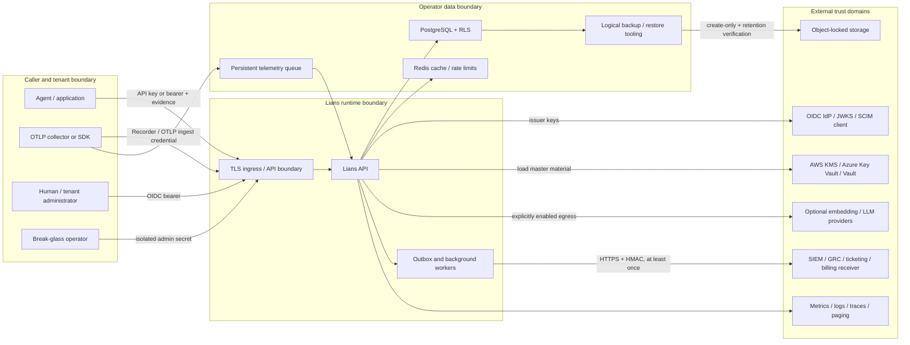

# Lians production threat model

This document models the self-hosted Lians decision-evidence platform: the API
and background workers, Universal Recorder and OTLP ingestion, evidence and
memory records, Decision Receipts, Runtime Gate, Investigator and remediation,
enterprise identity, durable integrations, PostgreSQL/Redis dependencies,
cryptographic keys, backup/WORM tooling, release artifacts, and Kubernetes
deployment boundary.

It reflects the controls present on the repository's current default branch. It
is a living engineering model, not a certification, penetration-test result,
regulatory opinion, or assertion that an arbitrary deployment is secure. Report
a suspected product vulnerability through the private process in
[SECURITY.md](../SECURITY.md).

## Scope and security objectives

The primary objectives are:

1. **Tenant and barrier confidentiality.** A principal can access only its
   server-derived namespace and the information-barrier view it is authorized to
   see.
2. **Evidence integrity and provenance.** A verifier can detect alteration of
   receipts, approval/review/closure attestations, Gate outcomes, outbox events,
   and the ordered audit history, subject to the trust anchors described below.
3. **Authentic control decisions.** Identity, scopes, roles, barriers, policy
   versions, receipt trust, and approval quorums used by Gate are not accepted as
   free-form client assertions.
4. **Confidential handling.** Sensitive memory content, approval/review/closure
   text, integration credentials, and outbox payloads are encrypted at rest;
   capture and export minimize plaintext by default.
5. **Recoverability without silent corruption.** Backups, immutable-provider
   handoffs, restore drills, and migration/key-rotation procedures fail closed on
   detected mismatches.
6. **Available, bounded service.** Request size, rate, ingest quota, retry, lease,
   queue, and workload controls limit accidental and hostile exhaustion while
   making evidence loss visible.

Lians does not prove that a model output is correct, that every causal influence
was recorded, that an external source was truthful, that a human actually read an
approval statement, or that a provider completed the effect after a mediator
consumed a permit. Permit consumption proves redemption of the declared exact
request digest, not provider execution or outcome. A receipt proves the integrity
of its recorded boundary; it is not deterministic replay of a nondeterministic
system.

### In scope

- FastAPI routes and in-process workers in `agentmem/src/lians`.
- PostgreSQL schemas and Alembic security controls, with Redis as cache and
  distributed rate-limit state.
- Native Recorder, MCP, A2A, and OTLP/HTTP inputs and the SDK builders.
- OIDC/JWKS authentication, SCIM provisioning, API keys, tenant-issued workload
  credentials, and the global break-glass administrator secret.
- Evidence graph, bitemporal records, Gate, approvals, reviews, investigations,
  closure attestations, audit chain, and integration outbox.
- KMS-backed master-key loading and rotation, receipt signing, logical backups,
  restore drills, and provider-immutable handoff.
- Maintained container build workflows and deployment manifests.

### External and shared-responsibility dependencies

Customer applications, models and tools, identity providers, KMS products,
PostgreSQL/Redis services, ingress and DNS, cloud control planes, external model
providers, integration receivers, observability backends, object storage, and
CI/registry services are not controlled by the Lians process. Their interfaces
and failure modes are in scope; their internal correctness is not.

## Control ownership

| Owner | Required responsibility |
|---|---|
| Lians software | Authenticate requests, derive authorization server-side, apply app filters and PostgreSQL RLS context, validate/canonicalize inputs, seal designated fields, bind and verify evidence, write audit/outbox records transactionally, and fail production startup on unsafe supported configuration. |
| Deployment operator | Terminate and verify TLS, use non-superuser database roles, apply migrations, isolate secrets and admin routes, constrain egress, configure IdP/KMS/Redis/PostgreSQL, pin and verify images, monitor queues and integrity, create external anchors/WORM copies, back up, restore-test, and respond to incidents. |
| Tenant administrator | Provision least-privilege identities and barriers, activate residency/capture/quota policy, review Gate policy and approval semantics, classify data, manage retention/erasure, and reconcile integrations. |
| Calling application | Propagate stable identities and correlation IDs, avoid sending secrets, call Gate before the protected side effect, request a separately authenticated mediator, and preserve returned receipt/evaluation identifiers. |
| Enforcement mediator | Be the provider's exclusive authorized caller, hash the actual canonical provider/tool request, consume its exact short-lived permit once immediately before dispatch, keep tokens out of logs/storage, and use provider idempotency. |
| Downstream receiver | Verify TLS and HMAC, enforce timestamp tolerance, deduplicate by `Idempotency-Key`, restrict retained content, and reconcile at-least-once delivery. |

## Assets

| Asset | Confidentiality/integrity concern |
|---|---|
| Memory and evidence content | May contain PII, PHI, MNPI, legal privilege, prompts, tool arguments, model output, or business secrets. |
| Metadata, embeddings, hashes, and graph links | Can reveal identity, relationships, equality, timing, source use, and sometimes approximate or dictionary-recover low-entropy content. |
| Namespace and barrier assignments | Define the tenant and Chinese-wall authorization boundary. A null barrier is tenant-wide visibility, not “no access.” |
| OIDC, SCIM, API-key, workload, metrics, and admin credentials | Permit authentication, provisioning, observation, or global administration. |
| Gate policies and outcomes | Determine whether a declared action is allowed, denied, or requires review. |
| Approvals, reviews, cases, tasks, and closure attestations | Evidence of human/workload oversight and remediation; optional text can itself be sensitive. |
| Decision Receipts and trusted issuer keys | Portable evidence whose meaning depends on canonicalization, signing-key custody, and verifier trust configuration. |
| Audit chain and Merkle anchors | Establish order and tamper evidence; need an external trusted anchor to resist wholesale privileged rewrite. |
| Integration destinations, payloads, attempts, and idempotency keys | Contain secret egress configuration and evidence of external delivery. |
| Master keys, wrapped subject DEKs, receipt signing keys, and historical backup keys | Compromise exposes data or permits forged receipts; premature loss can make retained data unrecoverable. |
| Backups, manifests, WORM versions, and restore reports | Contain the full encrypted system of record and evidence needed for recovery. |
| Image digests, lockfiles, SBOMs, signatures, and provenance | Define what code ran and whether release artifacts came from an expected workflow. |
| Availability and telemetry | Loss or manipulation can hide evidence gaps, block Gate decisions, exhaust recovery windows, or make an unhealthy system appear healthy. |

## Actors and assumed capabilities

- **Unauthenticated network attacker:** can send arbitrary requests to exposed
  ingress endpoints and observe responses and timing.
- **Compromised tenant credential:** has the scopes, namespace, role, and barrier
  bound to one API key or OIDC identity and attempts lateral or privilege
  escalation.
- **Malicious or compromised tenant administrator:** can exercise legitimate
  tenant admin operations and may try to weaken capture, quotas, Gate policy, or
  integration controls.
- **Break-glass administrator:** possesses `X-Admin-Secret` and can operate
  cross-tenant identity, key, governance, audit, and provisioning surfaces.
- **Platform insider or workload compromise:** can read pod memory or mounted
  secrets and use the application database/KMS identity.
- **Database superuser/table owner or backup operator:** can bypass ordinary SQL
  restrictions, inspect ciphertext and metadata, and potentially rewrite or
  replace evidence.
- **External service adversary:** controls or compromises an IdP/JWKS endpoint,
  embedding/LLM provider, DNS answer, integration receiver, monitoring backend,
  registry, or cloud API.
- **Supply-chain adversary:** compromises a dependency, maintainer account,
  workflow action, build runner, package registry, or artifact registry.
- **Accidental operator:** misconfigures a region, barrier, key, migration,
  retention policy, network rule, or recovery target.

No application control is expected to withstand a simultaneously compromised
application process, database superuser, KMS administrator, release authority,
and external evidence archive. Separation of duties is required to avoid that
single composite trust domain.

## Architecture and trust boundaries

| Boundary | Trust decision and control |
|---|---|
| Internet/client to ingress | TLS, upstream request limits, application body cap, network and credential rate buckets, then API authentication. Lians itself does not provision the certificate or DDoS service. The network bucket is only as accurate as the deployment's trusted-proxy/client-address configuration. |
| Credential to authorization context | Exactly one API key or bearer is accepted. Namespace, role, scopes, barrier, principal type, and credential reference come from stored key/binding state, not ordinary request bodies. |
| Break-glass administration | The supported public chart sets `API_SURFACE=public`, registers no break-glass routers, and receives no `ADMIN_SECRET`. A separate `API_SURFACE=admin` process may use the constant-time secret and `__admin__` RLS sentinel only behind private ingress, external strong operator authentication, and dedicated alerting. |
| Application to PostgreSQL | Transaction-local namespace/barrier GUCs, application predicates, forced namespace RLS and restrictive barrier policies on protected tables. The public API uses a non-owner, NOSUPERUSER/NOBYPASSRLS login inheriting the fixed, non-owner NOLOGIN/NOSUPERUSER/NOBYPASSRLS `lians_runtime` capability; a separately held migrator owns schema and is never projected into API pods. |
| OTLP producer to collector queue | The generic gateway writes raw producer OTLP to `file_storage` before Lians applies capture minimization. Enabling it requires a named encrypted StorageClass plus explicit raw-payload custody/policy acknowledgement, but operators must independently verify CSI encryption, keys, snapshots, replicas, attachment access, retention, incident hold, and deletion. |
| Application to Redis | Redis is non-authoritative cache/rate-limit state. Outage behavior is configured as bounded local, deny, or open; production rejects open. |
| Application to IdP/JWKS | Administratively registered exact issuer/JWKS policy, HTTPS by default, bounded fetch timeout, no redirects, address checks, algorithm/key-type validation, and cached keys. |
| Application to KMS | Workload identity or configured provider credential retrieves a 256-bit master key into process memory. KMS policy and audit are external controls. |
| Application to model providers | Optional embeddings and LLM adjudication can disclose input. `AIRGAP_MODE` rejects external model configuration and disables every application-managed payload exporter; a network egress policy remains the independent enforcement boundary. |
| Worker to integration receiver | HTTPS destination validation, address screening, no redirects/proxy environment, HMAC, stable idempotency key, bounded response digest, retries and dead letter. Egress firewall remains required. |
| Database to backup/WORM | Logical bundle hashes detect corruption. The provider uploader verifies immutable object versions and retention, then stores the canonical core attestation create-only under its digest in the same locked prefix; a local anchor record binds the exact provider version/generation back to that core. |
| Build to deployment | Hardened production-image workflows emit scans, SBOMs, provenance, and keyless signatures. Operators must verify and deploy by digest; repository workflows outside those paths do not automatically inherit the same guarantee. |

## Security invariants

1. A normal caller cannot select its namespace, effective scopes, role, or
   principal barrier through request content.
2. A barrier-scoped principal can see its own barrier plus records deliberately
   tagged tenant-wide; an unbarriered principal can see all barriers in its
   namespace. Cross-namespace access is never implied by an unbarriered tenant
   principal.
3. OIDC authorization is an administrator-owned exact `(provider, subject)`
   binding. SCIM payload fields do not directly grant roles/scopes/barriers.
4. Tenant workload credentials can be created only by a human OIDC administrator,
   expire, and cannot exceed the caller's scopes, role-delegation set, or barrier.
5. A Gate approval is counted only from the latest, unexpired, integrity-valid
   event in a principal's series and only for the exact action/policy/receipt
   boundary. One principal contributes at most one approval.
6. Gate outcomes, approval and review events, closure attestations, outbox events,
   delivery attempts, and governance revisions use append-only evidence records
   or guarded immutable definitions as documented by their migrations.
7. The audit chain has one serialized parent per namespace and verification must
   report forks, orphans, altered hashes, and truncation. This is detection, not
   prevention by itself.
8. New sealed values identify the current master-key version; reads accept only
   current and at most one explicit previous key during a rotation window.
9. Sensitive read expansions such as approval/review/closure text and outbox
   payloads are excluded by default and require admin scope when exposed.
10. A backup or WORM handoff is not successful merely because bytes were written;
    checksums, schema, source identity, object version, effective retention, and
    restore behavior must be verified.

## Principal data flows and controls

### Authentication, OIDC, SCIM, and workload credentials

API keys and SCIM/workload secrets are generated at high entropy, returned once,
and persisted as SHA-256 digests. API-key authentication rejects revoked and
expired rows. OIDC verification restricts issuer, audience, configured algorithms,
JWK key type/curve or RSA size, signature, `exp`/`nbf`/`iat`, maximum token age,
required claims, exact subject binding, and optional authorized party. A JWT
header cannot redirect trust through `jku` or `x5u`.

SCIM uses independently rotatable, optionally expiring bearer credentials and
optimistic `If-Match` versions. Production operators must set and enforce an
expiry. Provisioned group membership is reconciled to stored identity
bindings through administrator-owned entitlement mappings; ambiguous multiple
roles or barriers, more than 50 scopes, more than 1,000 Users in a Group, or
more than 1,000 Groups for a User fail closed without partial reconciliation.
The database serializes the inverse membership capacity. Tenant workload credential creation/rotation/
revocation is deliberately separate from the global admin route and requires a
human OIDC principal with admin scope. Delegation is a subset operation and a
barrier-scoped administrator cannot mint an unbarriered credential.

Residual boundary: possession of a bearer/API/SCIM/admin secret is sufficient
until expiry or revocation. Lians does not implement MFA, device assurance, token
binding, or a just-in-time approval ceremony. OIDC/SCIM lifecycle latency and
break-glass custody are operator responsibilities.

### Tenant and information-barrier isolation

The request dependency installs namespace and barrier in transaction-local
PostgreSQL settings and the database begin hook re-applies them after transaction
boundaries. Protected record tables have namespace RLS plus restrictive barrier
policies; service queries also carry namespace/barrier predicates. PostgreSQL
errors while establishing RLS context propagate rather than silently disabling
the control.

Before that context exists, PostgreSQL API-key and OIDC binding resolution uses
two exact, PUBLIC-revoked SECURITY DEFINER functions. Direct runtime reads of the
underlying tables are RLS-constrained. These tables deliberately do not FORCE
owner RLS because the table-owner function is the narrow pre-authentication
bypass; readiness verifies its owner, fixed settings, grants, and the runtime's
non-owner/non-BYPASSRLS identity. The functions return only active authorization
fields, never a credential digest or external subject.

Barrier semantics intentionally allow a scoped principal to see records whose
`barrier_group` is null. A missing tag therefore means tenant-wide, not denied.
Provisioning and ingestion must fail safe against accidental null tagging where
the data is wall-restricted. An unbarriered compliance/owner credential is a
powerful tenant-wide credential.

SQLite does not provide equivalent RLS and relies on application predicates; it
is a development/test profile, not the production multitenancy boundary. A
PostgreSQL superuser, `BYPASSRLS` role, stolen application database credential
that can set the admin sentinel, or missing migration can defeat isolation.

### Universal Recorder and capture privacy

Recorder inputs are schema-normalized, correlated, deduplicated, and persisted
under the authenticated namespace/barrier. Capture modes are `metadata_only`,
`hash_only`, and explicitly enabled `full`. Secret-like fields are redacted even
during full capture; sensitive-field declarations add targeted redaction. Global
and active namespace policy can restrict modes, processing region, and daily
event/decision/memory/byte reservations. Client-supplied region headers are not
trusted.

`hash_only` minimizes persisted plaintext but does not make sensitive input safe
in transit: clients can still send plaintext to the API before it is transformed.
Use TLS and preferably hash or omit content at the instrumentation boundary.
Hashes leak equality and low-entropy values can be guessed. Correlation IDs,
timestamps, model/tool identifiers, extensions, diagnostics, and graph structure
remain metadata. Active governance is opt-in; an unconfigured or disabled policy
preserves legacy unlimited behavior.

Memory erasure clears ciphertext, embedding, and metadata, removes denormalized
live facts, and destroys the subject DEK. Tombstone identifiers, content hashes,
audit payloads, and erasure evidence remain by design and may still be personal
data. Audit/event payloads outside Recorder have their own minimization duties.

### Decision Receipts and receipt trust

`DecisionCreate.agent_id` and telemetry agent attributes are claimed workload
labels, not authenticated identities. New DecisionRecord v3 hashes separately
bind the canonical API/OIDC principal, server-observed auth method, a
non-secret credential reference, principal type, optional role, and complete
bounded effective scopes. Existing verified v2 hashes remain valid but carry no
authorization snapshot; no migration infers one from current identity state.
PostgreSQL rejects mutation, deletion, and
truncation of the hash-covered record; the only mutable review projection must
match the latest immutable review event. Legacy records are explicitly
`legacy_unverified`. Before export or signing, Lians recomputes the record hash
and verifies the unique `decision_recorded` audit binding; absence, duplication,
or mismatch fails closed. See
[DecisionRecord authenticity and integrity](decision-record-integrity.md).

Receipt v0.1 canonicalizes a protected JSON document with the declared
`json-sort-keys-utf8-v1` method, hashes it with SHA-256, and can sign that hash with
Ed25519. Production startup requires a valid receipt-signing private key and key
ID. Verification checks exact schema/version/field shape, canonical hash,
signature, key ID consistency, and—when supplied—a trusted public key.

An embedded public key proves only that the matching private key signed the
receipt. A consumer must require a signature and establish the issuer/key through
the trusted receipt-key registry or an independently controlled trust channel.
The canonicalization profile is Lians-specific, not RFC 8785. The receipt-signing
private key is loaded into application process memory; it is separate from the
KMS-backed master encryption key and is not currently a remote HSM signing
operation.

Receipts preserve what Lians recorded through that authenticated boundary. A valid receipt can faithfully sign
incomplete, false, stale, or attacker-supplied evidence if upstream capture or
issuer controls fail. Completeness disclosures and source-content defaults must
remain visible to verifiers.

### Runtime Gate, approvals, reviews, and remediation

Gate selects an active immutable policy version visible in the authenticated
namespace/barrier, replaces caller-supplied principal scope/barrier context with
the authenticated values, validates linked decisions/change events, resolves
trusted receipt material, and appends an immutable allow/deny/review evaluation.
Approval IDs resolve to append-only role-bound series whose context includes the
action, target, policy ID/hash, linked records, barrier, and receipt hash.
Free-form approval claims are rejected. A restrictive policy default applies
when no rule matches; at least one rule must match and every matched requirement
must pass before the evaluator changes that posture to `allow`.

For a linked Lians decision, the route derives decision type, recorded policy,
and current/unerased source status from the server-side record and evidence rows.
The trusted receipt verifier additionally binds the signed namespace, decision ID,
decision type, and policy version to that boundary. Unlinked requests cannot
self-assert current sources or policy attachment; a cryptographically verified
receipt may provide the latter.

Approval statements and review/closure text are purpose-separated AES-GCM sealed;
their hashes remain in immutable event payloads. Review events chain sequence and
prior hash. Tasks must have closure attestations before a case closes, and case
closure requires a resolution summary.

Gate policy choice is not caller-controlled. Active policies map exact action names
and boundary-safe canonical resource URI selectors, every evaluation requires a
linked decision and target, and same-barrier overlap or missing mappings fail
closed. The linked decision's authenticated v2 record hash and unique immutable
audit binding are verified before evaluation. Decision type, risk, policy, source currency, and recorded detector signals
are server-derived. Every policy also names exact canonical enforcement principals
and a permit TTL no greater than 300 seconds. An allow evaluation atomically issues
one opaque permit bound to the action, target, decision, immutable policy,
enforcement principal, and canonical downstream-request digest. Only that
authenticated mediator can consume the permit, once, before expiry; the database
appends the consumption under advisory/row locking and refuses mutation or
truncation. Deny/review issues no permit. The provider must accept calls only from
the mediator—direct evaluator access remains an external bypass. See
[Gate execution permits](gate-execution-permits.md).

A named role is required for an approval. A Gate rule can additionally require
eligible attestations to come from a human OIDC binding and fall within a bounded
maximum age, so API-key/workload attestations cannot satisfy that rule. A stored
`human` classification still does not prove a live person, MFA, step-up, liveness,
or device assurance; high-risk policy needs those IdP and separation-of-duties
controls as well. Closure endpoints bind the actor to authentication but do not
independently require two-person review.

### Audit chain, immutable evidence, and durable integrations

`chain_log()` serializes writes per namespace with a PostgreSQL advisory lock;
the unique `(namespace, prev_hash)` parent constraint prevents forks under normal
application writes. Each hash covers ordered core fields and the versioned payload
representation. Approval, review, Gate, closure, outbox-event, delivery-attempt,
and governance-revision tables add database mutation guards and chain/shape
constraints where their migrations specify them.

The general `event_log` is protected by a PostgreSQL-owned v3 append function,
mutation-rejecting triggers, forced RLS, and an explicit `lians_runtime`
capability role. Production startup refuses a runtime that owns the relation or
function, bypasses RLS, has direct audit DML, lacks the capability grant, or sees
an incomplete boundary. SHA-256 chains are not keyed: a schema/database
administrator able to disable those controls and replace the complete history
can recompute it. A
full, untruncated verification against an independently retained tip, receipt,
Merkle anchor, or WORM export is the meaningful check. Barrier-scoped Investigator
views intentionally cannot claim namespace-wide audit verification.

The durable integration path inserts source mutation, audit event, encrypted
outbox event, and initial deliveries in one transaction. Workers lease rows with
`SKIP LOCKED`, retry retryable failures, dead-letter terminal failures, and preserve
immutable attempt records. Delivery is at least once. A crash after the receiver
accepts but before Lians commits success can duplicate a request; the receiver must
deduplicate the stable key. The legacy webhook/SIEM paths are best effort and do
not inherit the transactional outbox guarantee. `AIRGAP_MODE` rejects configured
external models, SIEM, Stripe, and application OTLP exporters at startup and also
disables legacy webhook dispatch/registration, durable integration delivery,
metering, and telemetry at their call and worker boundaries. It is still not a
network firewall: IdP/JWKS, KMS, DNS, database, Redis, dependencies, and future code
must be constrained by an independently verified deny-by-default egress policy.

Destination validation blocks credentials in URLs, query/fragment secrets,
redirects, proxy environment variables, insecure HTTP in production, and
non-public addresses unless explicitly enabled. The transactional outbox pins a
validated send-time IP while preserving the configured hostname for TLS SNI and
certificate verification, closing its DNS validation/connect race. Application
checks still do not replace a network egress firewall, and a malicious allowed
receiver can retain any payload intentionally sent to it.

### Encryption, KMS, erasure, and master-key rotation

Per-subject content keys encrypt memory content with AES-256-GCM. The master key
wraps those DEKs and purpose-separated sealed fields. Supported production key
sources are AWS KMS envelope decryption, Azure Key Vault, or Vault; production
rejects the environment-key provider. New v2 envelopes identify the key version,
and readers accept a bounded current/previous keyring. Configuration validation
requires distinct identifiers and material, at most one previous key, and previous
material from the same selected provider as the current key.

The offline rotation tool inventories every sealed field, authenticates old
values, requires a recent verified backup and exact schema/function/trigger/
owner state, and serializes operators with a transaction-scoped advisory lock.
Before it activates a bounded dual-ID fence, it takes write-conflicting locks on
every table carrying master-key-derived values, waiting out pre-existing writes
and blocking new ones until commit. Persistent `BEFORE INSERT OR UPDATE`
triggers then reject plaintext, v1, malformed subject-DEK headers, malformed v2
sealed values, and v2 identifiers outside the prepared current/previous pair.

Apply takes the same fixed-order table locks and holds them through inventory,
transactional rewrap, read-back, immutable-hash verification, checkpoint, and
an atomic fence narrowing to the current ID. It temporarily disables only the
enumerated append-only triggers while rewriting their protected storage; fence
triggers remain enabled. The prior key must not be removed until both the
narrowed-fence assertion and safe-removal inventory report zero legacy,
previous-key, unknown-key, and plaintext values.

KMS envelope loading still places raw master material and decrypted DEKs in Lians
process memory. Remote KMS policy limits who can bootstrap the key but does not
protect plaintext from a compromised running process. Key caches trade latency for
exposure duration. Rotation accepts only one previous live key, while old backups
may require keys older than that; historical key escrow and deletion protection
must outlive every retained backup. A missed old-current replica may suffer
write/read failures after narrowing, but cannot repopulate old-key data: a write
that began earlier finishes before the operator's locks are acquired, and a
later write waits until commit and is rejected by the narrowed trigger fence.
Replica drain is therefore an availability requirement, not an integrity
assumption. The table owner/superuser can still alter or disable the fence and
remains a privileged trust boundary. Crypto-shred is irreversible, including
during restore, unless an older backup plus its historical key still contains
the subject.

### Backup, WORM, and restore

Logical backup tooling refuses implicit production targets, captures source and
migration identity, creates a custom-format archive, verifies its table of contents,
hashes artifacts and canonical manifest, and publishes atomically. Restore tooling
requires an isolated nonproduction target, rejects the primary database identity or
endpoint, requires an empty restore-named database, verifies bundle hashes, and
performs structural/RLS/audit-topology checks. Application-level reconstruction and
full audit/receipt verification remain required before a drill passes.

Checksums detect accidental or partial corruption but are not signatures against an
attacker who can replace the entire local bundle. The provider uploader re-verifies
every object, uses create-only/version preconditions, checks provider ownership,
checksums, retention lock, legal/temporary hold, and immutable object identity, and
emits a schema-validated core attestation. It stores the exact canonical core bytes
create-only under a digest-derived name in the same locked/versioned prefix, rereads
that exact provider object, and emits a separately checksummed anchor record binding
the provider version/generation back to the core. The standalone verifier validates
all four local artifacts and rereads the immutable provider anchor with read-only
workload identity. This avoids an application signing secret, but assurance still
depends on independently governed provider IAM, audit logs, retention policy, and
recovery custody. `WORM_MODE=true` is an operator assertion, not an enforcement
switch.

The backup role necessarily has broad read visibility and must be isolated from the
application role. A restore executes content from the database archive and must use
a trusted source or a quarantined inspection path. The supplied backup CronJobs are
suspended by default until image, identity, storage, network, retention, and restore
evidence are configured.

### Supply chain and deployment

The production API workflow pins third-party Actions by commit, builds each supported
platform once, scans every exact staged payload digest for high/critical findings,
promotes only those digests into one multi-architecture index, signs/attests that
exact index, and self-verifies it. Fly accepts only the verified artifact from a
successful same-repository default-branch push and deploys the digest without a
production-token source rebuild. Backup image workflows likewise build locked
dependencies, publish SBOM/provenance, sign keylessly, and self-verify. The application Dockerfile
pins base images and uv by digest, installs from `uv.lock`, pins the embedded model
revision, disables remote model code, and runs non-root.

The Helm chart shares the lock-step application version and is released as a
separate OCI artifact. Its workflow renders every supported posture, attests and
keyless-signs the published digest, re-pulls that digest, byte-compares the package,
and verifies both trust paths before reporting success.

These controls do not prove absence of malicious source, build-runner compromise, or
unknown vulnerabilities. Every repository Action reference is commit-pinned and CI
rejects mutable references, but test/package/deploy workflows do not all publish the
same SBOM, provenance, scan, and signature set as the maintained production images;
they remain separate supply-chain surfaces. Consumers must verify the exact workflow
identity and digest they deploy.

The production Helm chart requires digest-pinned images, separate runtime/migrator
database Secrets, public-only API routing, and existing Secrets and provides
non-root/read-only/drop-capability/seccomp settings, token automount off,
default-deny NetworkPolicies, migration job, PDB/HPA/topology controls, monitoring,
and suspended backup. Its optional raw collector queue requires an explicitly named
encrypted StorageClass and custody acknowledgement. Kubernetes NetworkPolicy cannot allow-list an
FQDN by itself, and ingress TLS termination does not automatically provide mTLS or
re-encryption to the pod. The raw Kustomize reference uses digest-only image
subjects, split credential objects, namespace default-deny, and fixed-destination
TEST-NET placeholders; an environment overlay must still replace every deliberately
non-runnable identity, digest, TLS, storage, and network value before production.

## STRIDE abuse-case analysis

| Class | Abuse case | Implemented control | Limit / required owner action |
|---|---|---|---|
| Spoofing | Guess or replay an API/workload/SCIM credential | High-entropy one-time secret, digest-only storage, expiry/revocation, network and credential rate buckets | Protect clients and logs; shorten TTL; revoke on suspicion. A bearer is usable by its possessor. |
| Spoofing | Forge an OIDC token or choose attacker JWKS | Exact issuer registration, configured audience/algorithms, safe JWKS fetch, signature/time/age checks, no header `jku`/`x5u`, exact stored binding; unknown-key forced refreshes are lock-coalesced and cooldown-bounded per provider | Protect break-glass provider administration and IdP; require IdP MFA/device policy where needed. |
| Spoofing | Claim another tenant, role, scope, barrier, reviewer, or approver | Context is server-derived; OIDC identity is provider+binding UUID qualified; API/workload identity uses credential UUID, never labels; mismatching legacy actor fields are rejected; workload delegation cannot escalate | A stolen admin/DB credential can alter bindings. Monitor and separate duties. |
| Spoofing | Present a self-signed but untrusted receipt | Strict verifier can require Ed25519 and a trusted key; Gate uses trusted issuer/key records | Never equate an embedded public key or valid hash with trusted identity. |
| Tampering | Modify/reorder/delete audit history | Database-owned per-namespace v3 append, mutation triggers, forced RLS, serialized parents, fork/orphan verification | Keep runtime and migrator roles distinct, verify the live boundary without truncation, and retain external anchors/WORM. A privileged full rewrite can recompute an unkeyed chain. |
| Tampering | Rewrite approvals, reviews, Gate decisions, closure or outbox evidence | Append-only triggers, predecessor/context hashes, uniqueness and foreign-key constraints, immutable policy/key definitions | Table owner/superuser and the controlled rotation operator remain privileged. Monitor trigger/schema drift. |
| Tampering | Undrained replica writes a legacy or retired-key envelope across master-key rotation | Persistent bounded-ID fence triggers; fixed-order write-conflicting locks through inventory, rewrap, checkpoint, and atomic narrowing | Old replicas can lose availability; table owner/superuser can disable or replace the fence. |
| Tampering | Swap encrypted content or ciphertext | AES-GCM authentication, purpose/context separation for sealed fields, subject-specific DEKs | Compromised process can decrypt/re-encrypt; not every metadata field is encrypted. |
| Tampering | Replay an ingest or integration request | Recorder/memory idempotency and deduplication; stable receiver idempotency key | Recorder quota intentionally charges valid duplicate attempts; receiver must implement deduplication. |
| Tampering | Deploy substituted code or image | Lockfiles/digests, commit-pinned Actions, scan, SBOM, provenance, Cosign/GitHub attestations | Verify at admission by digest and workflow identity; require equivalent evidence for any additional distribution path. |
| Repudiation | Actor denies a decision, approval, review, or closure | Auth-derived principal references, timestamps, hashes, immutable event series, audit log | API-key identity may name a workload/label rather than a live human; external IdP/session evidence is needed for nonrepudiation. |
| Repudiation | Receiver denies delivery | HMAC, event/delivery IDs, immutable attempts, response status/digest | Lians does not retain response bodies; a 2xx proves protocol acceptance, not downstream processing. |
| Repudiation | Operator claims a backup/WORM control existed | Source/object identity, immutable version, retention/hold checks, digest-addressed immutable core attestation, exact-version anchor verification | Preserve all four local artifacts, the provider audit trail, and evidence of the verifier identity/policy in separately governed recovery custody. |
| Information disclosure | Cross-namespace or cross-barrier query | Auth-derived context, application filters, forced namespace RLS on ordinary tenant tables, restrictive barrier policies, exact SECURITY DEFINER auth lookups, scope-bound OTLP deduplication, and startup/readiness catalog discovery | PostgreSQL only; explicit trusted null tags are tenant-wide. The two auth tables omit FORCE for reviewed table-owner exact functions; compromise of that owner remains privileged. |
| Information disclosure | Recorder captures prompts, secrets, tokens, or tool payloads | Metadata/hash defaults, secret-key redaction, sensitive-field declarations, full-capture opt-in, namespace mode restrictions | Hashes/metadata still leak; the generic collector PVC holds raw pre-minimization OTLP. Hash/encrypt/omit at the producer and apply raw-queue custody controls. |
| Information disclosure | Database/backup theft | Encrypted content and sealed sensitive fields; KMS-wrapped DEKs; object-store encryption expected | Metadata, graph, embeddings on live rows, hashes, and identifiers may remain visible; historical keys plus backup can restore plaintext. |
| Information disclosure | Egress to model, IdP, integration, billing, or telemetry service | Air-gap checks cover external embedding/LLM configuration and stop the durable outbox worker; safe URL checks, encrypted outbox, HMAC, bounded metrics labels, no stored response bodies | The flag is not a universal firewall and does not disable every legacy/configured egress path. Enforce network egress, disable unused exporters/webhooks/metering, and review vendor contracts. |
| Information disclosure | SSRF through JWKS or integration URL | Scheme/credential/redirect/address checks, bounded DNS resolution, private-network opt-in | Use egress firewall/proxy/private endpoints; application DNS checks alone are not a complete SSRF boundary. |
| Information disclosure | Sensitive admin export or expanded Investigator view | Admin scope and default-redacted response modes; `Cache-Control: no-store` on designated secret/payload responses | Admin clients, browser history, support bundles, and observability need independent controls. |
| Denial of service | Anonymous or credential-rotation request flood | Body cap, network bucket, credential bucket, Redis distributed count and bounded fallback; arbitrary OIDC `kid` misses cannot force more than one refresh per provider cooldown | Add WAF/load-balancer DDoS control. Local fallback is per-process; health probes are exempt. |
| Denial of service | Exhaust tenant ingest or storage | Atomic daily namespace quotas, retry charging, payload bounds, Recorder/OTLP batching limits, deterministic Investigator read windows | Governance is unlimited until activated. Quotas do not meter every read, and bounded queries still need concurrency and database resource controls. |
| Denial of service | Slow/failed IdP, KMS, Redis, DB, model, receiver, or collector | Timeouts/caches, readiness, retry/backoff/dead letter, persistent telemetry queue, PDB/HPA/SLO rules | Size and monitor dependencies; define failure posture. Queue/disk exhaustion can still lose or delay evidence. |
| Denial of service | Hot namespace locks or expensive verification | Advisory/row locks preserve consistency; API list and scan limits bound many operations | Consistency can create contention. Isolate admin/full-audit work and enforce upstream concurrency/time budgets. |
| Elevation of privilege | Mint a stronger workload credential | Human-OIDC-only admin, subset scope check, role delegation matrix, barrier non-widening, TTL bounds | Global break-glass admin can still provision broadly; protect and audit it. |
| Elevation of privilege | Bypass RLS using database privileges or admin sentinel | Forced RLS on ordinary dynamically discovered tenant/barrier tables; auth-table RLS plus verified exact function posture; startup/readiness rejects missing policies/FORCE where required, superuser, `BYPASSRLS`, object ownership, owner-role assumption, or malformed capability posture; the legacy-restricted barrier cannot be assumed by a credential | Compromise of the separate owner/migrator can still alter the catalog or data; rotate credentials, segment DB, independently attest policy inventory, and alert on sentinel use. |
| Elevation of privilege | Turn full capture/private egress/insecure identity trust on | Production validation rejects unsafe supported settings; admin APIs version and audit policy changes | Platform administrators remain trusted. Enforce review/admission policy outside the process. |

## Availability and evidence-loss model

Lians distinguishes API availability from evidence durability. `/livez` should not
restart a process merely because a dependency blips; `/readyz`, black-box probes,
authenticated request metrics, Recorder acceptance, collector queue health, outbox
age/dead letters, database state, backup freshness, and restore drills are separate
signals.

Built-in controls include a streaming request-body cap, Redis-backed network and
credential rate buckets, a lower admin-network bucket, bounded local or deny Redis
failure posture, per-namespace atomic daily write/byte quotas, list/scan limits,
leased outbox concurrency, capped exponential retry, dead letter, HPA/PDB/topology
templates, and a persistent OTLP queue.

They do not replace upstream DDoS protection, connection limits, statement/idle
timeouts, database resource governance, per-endpoint concurrency, disk/PVC quotas,
or provider capacity planning. In particular:

- `local` rate-limit fallback is bounded but not globally coordinated across pods;
- `TRUSTED_PROXY_CIDRS` is empty by default, so forwarded addresses are ignored;
  exact immediate-proxy CIDRs are required to separate clients behind ingress;
- the application accepts one bounded `X-Forwarded-For` chain only from a
  trusted peer and walks it right-to-left; malformed or ambiguous input falls
  back to the socket peer without logging the raw header;
- `deny` protects capacity during Redis failure but creates an availability
  dependency;
- active namespace governance is required for quotas; default/unconfigured is
  unlimited;
- expensive graph, impact, Investigator, export, and full-chain operations still
  require operational concurrency controls;
- outbox/collector retries preserve data only while database/PVC capacity remains;
- health endpoints are deliberately exempt from application rate limiting; and
- a successful ingest response is not proof that every downstream export or
  external integration completed.

Use the objectives and alerts in [slo-alerting.md](slo-alerting.md), but treat their
initial targets as launch gates that require measured drill evidence, not inherited
service guarantees.

## Incident response

### Detection triggers

Declare or investigate a security incident for any suspected cross-tenant/barrier
read, invalid receipt signature/trusted-key mismatch, audit fork/orphan/hash failure,
append-only trigger drift, unexpected admin-sentinel use, secret/key disclosure,
unapproved full capture or egress, WORM retention mismatch, restore identity mismatch,
unknown deployed digest, Cosign/provenance failure, repeated outbox signature/replay
anomaly, material queue loss, or unexplained Gate bypass.

### Containment

1. Appoint an incident commander and scribe; use UTC and freeze deployments,
   migrations, retention jobs, identity-policy changes, and key rotation.
2. Fence the affected action path. Make the caller fail closed on Gate, revoke
   implicated API/workload/SCIM/OIDC bindings, isolate the break-glass route, and
   block suspicious egress or destination traffic.
3. Quarantine affected replicas without destroying disks or memory evidence.
   Preserve database/WAL, cloud audit, IdP, KMS, registry, ingress, outbox, and
   collector records.
4. Do not delete or rotate the master/receipt key merely to “clean up.” Plan
   rotation after preserving evidence and determining which receipts/backups need
   the old key. Rotate exposed bearer/admin/database credentials promptly through
   a documented path.
5. If integrity is uncertain, stop trusted exports and external side effects;
   create a forensic backup and independent chain-tip/receipt/WORM snapshot.

### Investigation and scoping

- Record affected namespaces, barriers, principals, credential IDs, request IDs,
  decision/change/evaluation/case IDs, image digests, migration head, key IDs, and
  exact time interval.
- Run a full unbarriered audit verification with no truncation and compare against
  independently retained anchors. Verify affected receipt signatures and issuer
  keys, approval/review/closure chains, evidence links, Gate policy hashes, outbox
  attempts, and WORM object versions.
- Use Investigator blast radius as a lead, not a complete causal conclusion. Record
  scan truncation, lower-bound totals, unindexed legacy records, and hidden barrier
  scope.
- Determine whether capture, metadata, embeddings, backups, integration receivers,
  monitoring, or external model providers received affected content.

### Eradication and recovery

Patch from a reviewed commit, rebuild and verify a new digest, restore or migrate in
an isolated environment, rotate affected credentials/keys in dependency order, and
reconcile post-recovery writes and at-least-once deliveries. Exercise negative Gate,
RLS, receipt-trust, audit-tamper, egress, backup, and restore checks before reopening
side effects. Monitor queue drain and error budget after cutover.

Legal, privacy, compliance, customer, insurer, and regulator notifications depend on
the data and jurisdiction and must be decided by authorized operators. Preserve the
decision and evidence even when notification is not required. Finish with root cause,
control failure, achieved RPO/RTO, data-loss statement, owner/due-date remediation,
and a runbook/test update.

## Explicit residual risks

1. **Gate enforcement depends on exclusive mediation.** Single-use, audience- and
   request-bound permits close the ordinary "ignore allow/deny" path only when the
   protected provider accepts calls exclusively from the separately authenticated
   mediator. Direct evaluator credentials, compromised mediator identity, or a
   mediator that hashes different arguments can still bypass the boundary.
2. **Privileged platform compromise dominates.** A process-memory, database-admin,
   KMS-admin, or cluster-admin compromise can expose broad plaintext or alter trust
   state; separation and external evidence are required.
3. **The audit hash chain is not a secret signature.** Without external anchors and
   restricted mutation privileges, wholesale privileged replacement can be
   recomputed. Verification limits can also yield an incomplete conclusion.
4. **Receipt signing occurs in process.** The Ed25519 private key is application
   material, not a remote HSM signing primitive. Key compromise permits forged new
   receipts until trust is revoked.
5. **Receipt validity is not evidence truth.** Custom canonicalization and an embedded
   key require strict compatible verification and an independent issuer trust root.
6. **A human approval classification is not proof of presence.** Gate policy can
   exclude API-key/workload attestations and bound approval age, but MFA, step-up,
   liveness, device assurance, and separation of duties remain external controls.
7. **Metadata is sensitive.** Hash-only capture, content hashes, embeddings, graph
   topology, identifiers, timestamps, audit tombstones, and diagnostics can disclose
   relationships or support inference.
8. **Optional egress is disclosure.** Model providers, IdPs, receivers, Stripe,
   metrics, logs, and traces become additional data processors when configured.
   Air-gap mode rejects or disables every known application-managed payload exporter,
   but cannot constrain dependencies, privileged operators, IdP/KMS control traffic,
   or future code. A deny-by-default network policy is mandatory for an air gap.
9. **Application SSRF defenses are defense in depth.** The integration outbox pins
   validated DNS answers for its socket connection, but compromised DNS, explicitly
   allowed private networks, other egress clients, and cloud networking can create
   paths that only an egress firewall/service mesh/private endpoint can close.
10. **Integrations are at least once.** Duplicate delivery is expected after some
    crash windows; legacy webhook paths are best effort; a 2xx is not business-level
    reconciliation.
11. **WORM authenticity inherits provider governance.** The canonical core
    attestation is itself anchored as an exact create-only provider object and can be
    reread through the local anchor record, so replacing only the local evidence is
    detectable. A compromised provider control plane, verifier identity, retention
    policy, and audit-log boundary can still defeat that assurance; govern them
    independently and preserve the four-file result outside the uploader's boundary.
12. **Isolation is configuration-sensitive.** SQLite, missing migrations, superuser/
    `BYPASSRLS`, null barrier tags, or over-broad unbarriered credentials weaken the
    intended boundary.
13. **Governance defaults preserve compatibility.** Region, capture, and quota policy
    do not restrict a namespace until an operator activates them.
14. **Supply-chain evidence still needs enforcement.** Repository workflows use
    immutable action revisions and release paths generate provenance where the
    registry supports it, but branch/tag protection, environment approvals, trusted
    publishing setup, admission verification, and dependency-review ownership remain
    deployment controls.
15. **Application limits are not a DDoS service.** Per-process fallback, trusted-proxy
    mistakes, expensive read/admin operations, dependency saturation, and finite
    queue/storage capacity need infrastructure controls and tested sizing.
16. **Historical recovery conflicts with key deletion.** Old backups need old keys;
    subject erasure and key destruction require a deliberate policy for retained
    backups and recovery copies. The persistent database fence closes the
    old-replica write race, but old replicas can still fail reads/writes after
    narrowing and a table owner/superuser can bypass database enforcement.
17. **Subject references are pseudonymous, not anonymous.** New explicit subject and
    erasure-request identifiers are namespace-scoped HMAC references, and mutable
    derivative stores are scrubbed during erasure. A controller holding the HMAC key
    can still relink a candidate identifier; content hashes, timestamps, topology,
    legacy rows, free-form full capture, model training, logs, and downstream copies
    require their own retention/deletion controls. See
    `data-retention-and-subject-erasure.md`.
18. **Code controls do not attest deployment reality.** Readiness/capability responses,
    region strings, and `WORM_MODE` expose configuration state; they do not certify
    cloud location, personnel process, provider retention, or successful recovery.
19. **The durable collector widens raw-data custody.** Its generic file queue stores
    producer OTLP before Lians minimization. Helm acknowledgements cannot prove volume,
    snapshot, replica, node, backup, or key protection; operators must verify those
    controls and delete drained/orphaned PVCs under an approved retention/hold process.

## Production operator verification checklist

Record evidence for every checked item. A checkbox without an artifact, timestamp,
owner, and environment identifier is not a verified control.

### Identity and administration

- [ ] Set `DEPLOYMENT_ENVIRONMENT=production`; confirm startup rejects development
  admin/KMS/CORS/rate/capture/metrics/region/integration settings.
- [ ] Confirm the public deployment is `API_SURFACE=public`, registers no admin
  routes, and receives no `ADMIN_SECRET`. Run any `API_SURFACE=admin` process as a
  separate private deployment with a unique managed secret and alert on every use.
- [ ] Register exact OIDC issuer, audience, algorithm, required claims, token age,
  authorized party, and public HTTPS JWKS; probe and exercise revocation/key rollover.
- [ ] Require IdP MFA/step-up and device/session policy for tenant and break-glass
  administrators; Lians does not supply that ceremony.
- [ ] Give SCIM tokens expiry, least privilege, rotation ownership, and IdP-side secret
  storage; test deprovisioning and ambiguous entitlement failure.
- [ ] Prefer short-lived OIDC workload identity; otherwise bound workload credential
  TTL/scopes/role/barrier and test rotate/revoke/expiry.
- [ ] Keep metrics bearer, Recorder ingest, database, backup, integration, and admin
  credentials separate. Confirm one-time secrets never enter source, logs, or tickets.

### Database and tenant isolation

- [ ] Run supported PostgreSQL with all migrations at the expected single head; do
  not use SQLite for production multitenancy.
- [ ] Pre-create fixed `lians_runtime` as non-owner NOLOGIN/NOSUPERUSER/NOBYPASSRLS; run the
  API as a non-owner login inheriting it, and use separately held migration, backup,
  and restore roles/Secrets. Verify ownership, membership, and owner-role
  assumption after restore; production startup and `/readyz` must fail closed on
  any unsafe posture.
- [ ] Confirm startup, `/readyz`, and the migration postflight dynamically discover
  every public `namespace`/`barrier_group` column and reject missing
  `ENABLE ROW LEVEL SECURITY`, required `FORCE ROW LEVEL SECURITY`, or applicable
  namespace/restrictive barrier policy. Independently verify the two auth-table
  FORCE exceptions and their exact function owner/settings/ACL contract.
- [ ] Verify the runtime has no direct `INSERT/UPDATE/DELETE/TRUNCATE` on `event_log`; test that
  cross-namespace and cross-barrier reads/writes fail through SQL and API paths.
- [ ] Review every null barrier and every unbarriered credential as tenant-wide access.
  Test barrier changes and connection-pool transaction resets.
- [ ] Verify every historical OTLP span is `barrier_scope_trusted=true`; treat
  `__legacy_restricted__` as unverifiable and unbarriered-only. Reclassify it only
  from immutable proof of the exact historical scope under a reviewed migrator
  change, never from present-day names or configuration.
- [ ] Require exactly one `sslmode=verify-full` on every network PostgreSQL URL and
  peer-verifying `rediss://` for Redis, segment their networks, bound the worst-case
  HPA pool ceiling within the API-only connection allocation, bound statements/idle
  transactions, and ship privileged database audit logs.

### Data, Recorder, and privacy

- [ ] Activate namespace region, capture-mode, and daily event/decision/memory/byte
  policy; exercise denied region, denied full capture, quota exhaustion, and UTC reset.
- [ ] Default Recorder/OTLP to `metadata_only` or `hash_only`; leave full capture off
  unless a documented data owner approves it.
- [ ] Test redaction against organization-specific secret fields and nested payloads;
  hash or omit sensitive values before network transport.
- [ ] Treat collector `file_storage` PVCs as raw pre-minimization telemetry: verify the
  named StorageClass/CSI encryption and keys, restrict attach/snapshot/read/delete,
  monitor age/bytes/access, and enforce approved hold, retention, and deletion evidence.
- [ ] Inventory metadata, embeddings, graph links, audit payloads, logs, metrics,
  traces, integrations, and backups in the retention/privacy assessment.
- [ ] Exercise subject erasure and confirm ciphertext, embedding, metadata, live facts,
  cache entries, subject key, and downstream copies follow the approved policy while
  declared tombstone evidence remains.

### Keys, receipts, and control plane

- [ ] Use AWS/Azure/Vault KMS with workload identity and least-privilege decrypt/read;
  reject the environment provider and preserve KMS audit/deletion protection.
- [ ] Custody the Ed25519 receipt key separately from the master encryption key; publish
  the trusted public key/key ID, test strict verification, rotation, and revocation.
- [ ] Make consumers and Gate require signatures and a trusted issuer for consequential
  receipts; never trust an embedded public key alone.
- [ ] Give each protected provider only a separate mediator credential; put exact
  canonical mediator IDs and bounded permit TTLs in immutable Gate policies.
- [ ] Canonicalize and hash every security-relevant provider/tool argument; consume
  the matching permit once immediately before dispatch and never log/store its token.
- [ ] Test deny/review non-issuance, wrong mediator/action/target/decision/request hash,
  expiry, replay, concurrent redemption, provider idempotency, and direct-call denial.
- [ ] Require human OIDC plus external step-up/separation for high-risk approvals; test
  expired, superseded, wrong-policy, wrong-barrier, duplicate-principal, and revoked
  attestations.
- [ ] Verify review and closure integrity; require independent review where one writer
  must not close its own remediation.
- [ ] Rehearse the prepare/status/assert/apply master-key fence lifecycle on a
  restored production backup, drain every old
  API/worker replica before rewrite, keep current and one same-provider previous key
  through rewrap, run the zero-remaining safe-removal assertion, and escrow older
  backup keys for their full retention life.

### Audit, integrations, and egress

- [ ] Run full untruncated audit verification for every namespace and compare chain
  tips/Merkle anchors with an independently retained system.
- [ ] Export audit/receipt evidence to object-locked storage under a different role and
  account; verify the effective version and retention rather than a configuration flag.
- [ ] Use the transactional outbox for durable destinations; migrate off legacy
  best-effort webhooks or explicitly accept their loss boundary.
- [ ] Require HTTPS, keep private-network delivery off unless necessary, and enforce
  destination CIDR/FQDN policy through an egress gateway/firewall in addition to app
  validation.
- [ ] Have every receiver verify HMAC and timestamp, persist the idempotency key, return
  prior success on duplicate, and reconcile business processing beyond HTTP 2xx.
- [ ] Alert on oldest due outbox event, retry growth, dead letters, lease loss, signature
  failures, destination changes, and unapproved audit-payload inclusion.
- [ ] For air-gap operation, confirm startup rejects external models, SIEM, Stripe,
  and OTLP; exercise disabled webhook/outbox/metering paths; then test with an
  independent deny-all egress policy and allow only approved DNS, IdP, KMS, database,
  and Redis paths.

### Backup, recovery, supply chain, and availability

- [ ] Enable provider HA/PITR and monitor latest-restorable time; create daily verified
  logical bundles and complete monthly logical plus quarterly PITR restore drills.
- [ ] Run the WORM uploader under a dedicated cloud workload identity with no delete,
  overwrite, retention-shortening, hold-clearing, key-list, or policy-admin rights.
- [ ] Verify every provider object version/generation, checksum, retention and hold;
  require the digest-addressed immutable core anchor plus four-file read-only verifier
  result, and retain those artifacts with provider audit evidence in a separately
  governed recovery boundary.
- [ ] Keep backups, manifests, configuration, KMS versions, receipt public keys, image
  digests, and restore reports in separate recovery/security boundaries.
- [ ] Verify Cosign and GitHub provenance for the exact API and backup image digests
  and the Helm OCI digest at admission/promotion; confirm every API platform payload
  digest was scanned before index promotion and Fly used that immutable subject
  without rebuilding source; never deploy a mutable tag or `CHANGE_ME` value.
- [ ] Continuously verify immutable Action revisions; apply branch protection, least
  workflow permissions, environment approval, protected tags, and trusted-publisher
  ownership outside the repository.
- [ ] Use the production Helm posture or equivalently harden manifests: non-root,
  read-only filesystem, dropped capabilities, seccomp, token automount off, existing
  Secrets, default-deny NetworkPolicy, TLS, PDB/HPA/topology, and isolated migrations.
- [ ] Configure exact immediate-proxy `TRUSTED_PROXY_CIDRS`, keep Uvicorn
  `--no-proxy-headers`, and exercise spoof resistance plus independent client buckets
  through the real ingress and every service-mesh hop.
- [ ] Select Redis outage mode deliberately; add WAF/load-balancer limits, database
  limits, endpoint concurrency, queue/PVC alerts, and capacity tests beyond app limits.
- [ ] Page independently on API readiness, authenticated 5xx, Recorder/collector loss,
  outbox dead letters, audit integrity, KMS/key expiry, backup freshness, and failed
  restore drills. Exercise routing with synthetic data.
- [ ] Run a security incident exercise covering cross-tenant suspicion, Gate bypass,
  receipt-key compromise, audit failure, WORM mismatch, and compromised image; record
  achieved containment, RPO/RTO, notification decision, and remediation owners.

## Related runbooks and design references

- [Native OIDC identity federation](sso.md)
- [Enterprise SCIM provisioning](enterprise-provisioning.md)
- [Workload credential lifecycle](workload-credentials.md)
- [Namespace governance](namespace-governance.md)
- [Universal Recorder quickstart and privacy notes](quickstart-recorder.md)
- [Immutable approvals and reviews](immutable-attestations.md)
- [Durable integration outbox](integration-outbox.md)
- [Master-key rotation](master-key-rotation.md)
- [Backup and restore](backup-restore.md)
- [Verified WORM provider handoff](worm-provider-handoff.md)
- [Software supply-chain security](supply-chain-security.md)
- [Production operations](production-operations.md)
- [SLOs and alerting](slo-alerting.md)
