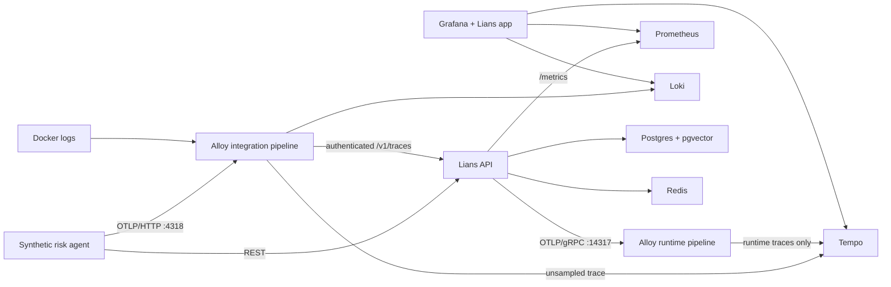

# Lians integration homelab

The homelab is an executable, local “enterprise-in-a-box” environment for
integration discovery, partner demos, operational learning, and safe failure
experiments. It exercises the real Lians API and decision-evidence model; it is
not a slideware mock.

The first proof target is Grafana. A synthetic risk agent recalls governed
memory, emits a standard OpenTelemetry trace, and seals a Lians Decision
Envelope. Grafana Tempo receives the trace for operations, while Lians receives
the same trace through its authenticated OTLP endpoint and binds it to the
decision's recall receipt and Evidence Pack.



The two Alloy trace receivers are intentional. Partner applications use the
standard OTLP ports `4317/4318`; Lians runtime telemetry uses internal-only
`14317/14318`. Sending Lians' own
instrumentation through the partner fan-out would make the instrumented
`/v1/traces` request generate another `/v1/traces` request forever.

## Quickstart

Prerequisites: Docker Desktop/Engine with Compose v2 and Python 3 for the
fail-closed sample preflight. A 4 GB WSL2 cap has passed the cached lightweight
smoke test on a 16 GB Windows laptop; allow 6–8 GB for a clean first build when
the host has enough memory.

```powershell
Set-Location homelab
.\lab.ps1 up
```

Linux/macOS:

```bash
cd homelab
sh ./lab.sh up
```

The launcher generates ignored local secrets, builds the stack, waits for a
complete synthetic decision, runs the verifier, and exports a JSON verification
receipt under `homelab/artifacts/`.

Open:

- Grafana: <http://localhost:3000/d/lians-homelab-proof>
- Lians API: <http://localhost:8001/docs>
- Prometheus: <http://localhost:9090>
- Alloy pipeline UI: <http://localhost:12345>

Grafana credentials are generated/copied into `homelab/.env`. All published
ports bind to `127.0.0.1`; Postgres and Redis have no host ports.

Useful commands:

```powershell
.\lab.ps1 status
.\lab.ps1 verify
.\lab.ps1 report      # print the latest sanitized evidence receipt
.\lab.ps1 logs
.\lab.ps1 down        # stop containers but retain local state
.\lab.ps1 dispose     # asks before deleting containers and volumes
```

`up` uses deterministic hash embeddings so the integration plumbing fits on a
16 GB laptop. They are explicitly test-grade and must not be used to demonstrate
retrieval quality. For a polished retrieval demo on a machine with more memory:

```powershell
.\lab.ps1 up-real
```

That optional profile bakes `BAAI/bge-large-en-v1.5` into the image and runs one
API worker. It uses a separate Compose project and data volumes so incompatible
embedding spaces can never mix; `verify-real` and `logs-real` target that project.
Starting either profile stops the other to avoid loopback-port conflicts. Plan
for 32 GB RAM for the most reliable full-stack demo experience.

## Run a bounded local sample

The checked-in `samples/default.json` is synthetic. To exercise the same local
API, telemetry, decision-envelope, and verification path with your own scenario,
copy it to an ignored `*.local.json` file and change only synthetic or already
de-identified values:

```powershell
Copy-Item .\samples\default.json .\samples\my-scenario.local.json
.\lab.ps1 check-sample -SamplePath .\samples\my-scenario.local.json -AcceptSamplePolicy
.\lab.ps1 up -SamplePath .\samples\my-scenario.local.json -AcceptSamplePolicy
.\lab.ps1 report
.\lab.ps1 dispose
```

Linux/macOS uses `--sample FILE --accept-sample-policy` with the equivalent
`lab.sh` commands. The acknowledgement is required only when the file declares
`"classification": "deidentified"`; it is an attestation, not an automated
de-identification service.

The v1 format is intentionally small: UTF-8 JSON up to 64 KiB, at most ten
memories, flat metadata with at most twenty fields, one decision, and one recall
query. Unknown fields, duplicate JSON keys, mismatched recall filters, common
credential formats, email addresses, U.S. SSNs, common U.S.-formatted phone
numbers, payment-card numbers, and sensitive metadata labels fail closed. The scanner is a
guardrail—not DLP—and the customer remains
responsible for authorization and de-identification.

Custom files stored inside this repository must be direct children of
`homelab/samples/` and end in `.local.json`, which is ignored by Git. Files
outside the repository are also accepted. The launcher resolves the final
symlink target before applying this rule and before creating the Docker mount.

The sample never leaves the local Docker host through this bundle. Raw
sample-derived state can remain in named volumes while the lab is running.
`dispose` deletes those containers and volumes while retaining the sanitized
reports in `artifacts/`. Reports intentionally include `scenario_id` and
`decision_type` (and derive some evidence source IDs from `scenario_id`), so use
opaque, non-sensitive identifiers. They also include the sample hash,
classification, and counts. They exclude `agent_id`, `subject_id`, query,
outcome, reason codes, recall-filter names and values, and memory content,
timestamps, sources, metadata, and importance values.

## Five-minute partner walkthrough

1. Open the provisioned Grafana dashboard and select a synthetic partner trace
   in the Tempo panel.
2. Run `lab.ps1 proof` (or `lab.sh proof`) and compare its `trace_id` with the
   Grafana trace. The sanitized receipt also shows the matching envelope and
   decision IDs, evidence source IDs, completeness grade, manifest/pack hashes,
   and explicit signature status without exporting recalled content or credentials.
3. Point out the same trace/span source ID under `evidence_sources`, the
   `replayable` grade, and the passing Prometheus, Loki, Tempo, Grafana, and Lians
   checks. A `-dirty` Git suffix means the images were built from local
   uncommitted changes, which keeps the provenance claim honest.

## What the verifier proves

The verifier fails the command unless it can establish that:

1. Lians is dependency-ready and exports real product metrics.
2. Prometheus is scraping the Lians target.
3. Grafana is healthy with file-provisioned datasources and dashboards.
4. Tempo and Loki are ready.
5. The workload produced a sealed decision and Evidence Pack.
6. The decision contains a bound recall receipt and OpenTelemetry evidence from
   the same trace sent through Alloy.
7. The regulated record reaches `replayable` completeness and the receipt is
   tied to the current Git revision plus declared component image tags.

The receipt shows that the declared local scenario completed against the listed
component versions. It does not establish general data compatibility, retrieval
quality, capacity, security, privacy, compliance, availability, Grafana catalog
status, or production readiness.

## Spec-driven integration workflow

Every new partner starts from [`specs/TEMPLATE.md`](specs/TEMPLATE.md):

1. State the partner question as observable behavior.
2. Define the exact integration contract and data policy.
3. Add a deterministic scenario and machine-verifiable acceptance checks.
4. Provision dashboards/configuration from Git—no manual UI-only setup.
5. Run failure drills and export a proof receipt tied to the Git commit.
6. Record limitations honestly before making a public compatibility claim.

The implemented Grafana slice is specified in
[`specs/001-grafana-local-proof.md`](specs/001-grafana-local-proof.md), and the
customer-run input boundary is specified in
[`specs/002-customer-run-sample.md`](specs/002-customer-run-sample.md).
Architecture choices are recorded under [`adrs/`](adrs/), and recovery exercises
live under [`runbooks/`](runbooks/).

## Data and security boundaries

- Lians-operated demos, committed fixtures, and CI use synthetic data only. A
  customer-run local lab may use an explicitly acknowledged, already
  de-identified sample under ADR 004. Never load PHI, credentials, production
  exports, or data you are not authorized to process.
- The Grafana plugin is unsigned development source. Local Grafana explicitly
  allows only `lians-lians-app`; this is not a catalog listing.
- `/metrics` includes tenant namespace labels and is reachable only on the
  internal telemetry network plus loopback Prometheus access.
- Alloy can connect to the Docker daemon socket for local log discovery. The
  mount's `:ro` flag does not restrict Docker API operations, so treat Alloy as
  host-privileged, never load untrusted collector code, and replace this path
  with a restricted log collector before any shared or production deployment.
- Lab volumes retain local sample-derived state for repeatable demos.
  `lab.ps1 dispose` / `lab.sh dispose` is the explicit destructive cleanup path.
- Local image tags are pinned in `compose.yaml`; production proof bundles should
  additionally record resolved image digests.

## Hardware path

Start with the machine you already own. The current lightweight stack needs no
GPU and is the right place to learn what partners actually ask for.

| Stage | Practical target | Use |
|---|---|---|
| Laptop MVP | 8 cores, 16 GB RAM, 100+ GB free | Build, smoke tests, screen-shared demos |
| Polished single node | 8–16 cores, 32–64 GB RAM, 2 TB NVMe, UPS | Real embeddings, longer retention, outage drills |
| Three-node lab | 3 × 8 cores / 32 GB / 1 TB, 2.5 GbE | Only when a partner needs node-loss, HA, or Kubernetes proof |

Do not buy a GPU for this MVP. Add a 16 GB-class GPU only if a customer scenario
specifically requires local generative-model inference; Lians itself does not.

## Next graduation gates

- Create a restricted, `NOBYPASSRLS` application database role; migrations keep
  a separate owner role.
- Add bounded k6 load scenarios and report measured p50/p95/p99, not theoretical
  capacity.
- Add automated collector, Redis, and Grafana outage drills.
- Correlate JSON logs with trace/span IDs and automatically scan telemetry for
  prohibited content.
- Add a Compose smoke job that installs all observability extras and builds the
  Grafana plugin in CI.
- Move to single-node K3s only when a real evaluation requires Kubernetes shape;
  move to three nodes only when HA behavior itself is under test.
